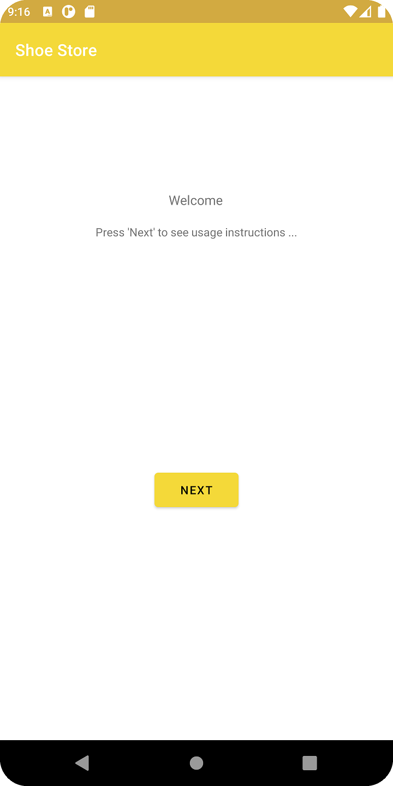
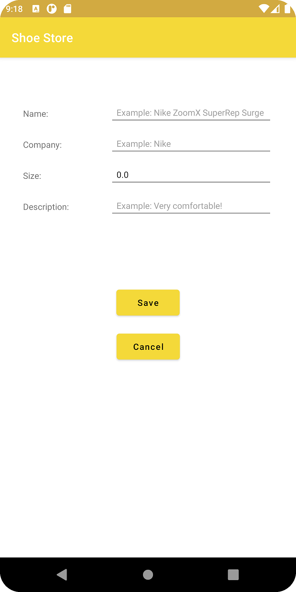

# Shoe Store

- Shoe Store Inventory App
- This is the first project in [Android Kotlin Developer Nanodegree](https://www.udacity.com/course/android-kotlin-developer-nanodegree--nd940)

### Installation

- Clone the **[repo](https://github.com/iAbdulhamid/android-kotlin-shoe-store.git)**.
- Open Android Studio.
- Select Open an Existing Project.
- Locate the project folder and click Open.
- Click the Run button.

## Built With
* [ViewModel](https://developer.android.com/topic/libraries/architecture/viewmodel)
* [LiveData](https://developer.android.com/topic/libraries/architecture/livedata)
* [Data Binding](https://developer.android.com/topic/libraries/data-binding)
* [Navigation Component](https://developer.android.com/guide/navigation/navigation-getting-started)
* [ConstraintLayout](https://developer.android.com/training/constraint-layout)

## Screenshots

 
 
 
 

